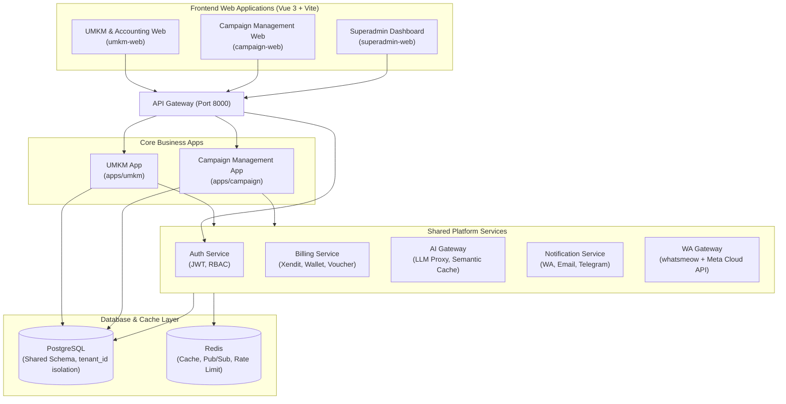

# WCH Platform — Master Plan & Architectural Blueprint

Selamat datang di **WCH Platform (Multi-Product Suite)**. Dokumen ini adalah Master Plan komprehensif yang dirancang untuk mengintegrasikan tiga produk besar Anda ke dalam arsitektur platform yang tangguh, terukur, dan aman:

1. ~~**SaaS Crypto Trading Bot**~~ *(ARCHIVED)*
2. **AI Agent UMKM & Pembukuan/Akuntansi**
3. **Aplikasi Manajemen Pemenangan Pemilu**

Dengan pendekatan **SaaS-First & Shared-Platform Monorepo**, ketiga produk ini akan berbagi layanan inti (*shared services*) seperti Autentikasi, Billing/SaaS Management, AI Gateway, dan Notifikasi untuk meminimalkan waktu pengembangan (Time-to-Market) dan redundansi kode.

---

## 1. Visi & Strategi Multi-Product Platform

Alih-alih membangun tiga aplikasi terpisah dari nol, kita mengadopsi pola **Shared Platform Architecture (Monorepo)**. Ini memungkinkan kita membangun fondasi kokoh sekali saja, lalu meluncurkan produk satu per satu di atas fondasi tersebut.



---

## 2. Analisis Mendalam & Fitur Utama Produk

### 🚀 ~~Produk 1: SaaS Crypto Trading Bot (`apps/crypto`)~~ *(ARCHIVED)*

> Produk ini telah diarsipkan. Kode tersedia di `apps/crypto/` untuk referensi historis namun tidak aktif dikembangkan.

---

### 💼 Produk 2: AI Agent UMKM & Pembukuan (`apps/umkm`)
Sistem asisten bisnis cerdas untuk pemilik UMKM yang menggabungkan asisten operasional (chatbot sales/support) dengan pembukuan keuangan otomatis.

*   **Fitur Utama**:
    1.  **AI Omni-Channel Chatbot**: Asisten virtual pintar di WhatsApp, Instagram, dan Telegram untuk melayani tanya jawab produk, cek stok, dan menerima pesanan dari pelanggan secara otomatis.
    2.  **AI OCR Receipt & Invoice Scanner**: Pengguna cukup memotret kuitansi belanja atau nota penjualan. AI akan mengekstrak data nominal, kategori pengeluaran/pendapatan, tanggal, dan nama vendor secara otomatis.
    3.  **Conversational Accounting**: Pemilik UMKM dapat mencatat transaksi lewat suara atau chat bahasa sehari-hari. Contoh: *"Tolong catat pengeluaran beli plastik pembungkus 50 ribu rupiah hari ini"*. AI akan menerjemahkannya ke jurnal debit/kredit yang sesuai.
    4.  **Laporan Keuangan Otomatis (GAAP/SAK-EMKM Compliant)**: Pembuatan otomatis Laporan Laba Rugi (Income Statement), Arus Kas (Cash Flow), dan Neraca Keuangan (Balance Sheet) yang mudah diunduh (PDF/Excel) untuk kebutuhan perpajakan atau pengajuan modal.
    5.  **AI Business Analyst & Recommendation**: Analisis tren penjualan, rekomendasi produk terlaris, prediksi stok habis, dan peringatan jika arus kas (*cash flow*) sedang tidak sehat.
*   **Komponen Teknis**:
    *   `chatbot/`: Integrasi LLM (melalui AI Gateway) dengan WhatsApp/Telegram API, manajemen memori percakapan, dan alur konversi pesanan.
    *   `accounting/`: Double-entry bookkeeping engine, manajemen chart of accounts (COA), audit trail, dan kalkulasi pajak sederhana.
    *   `automation/`: Pipeline otomatisasi yang menghubungkan n8n untuk sinkronisasi inventori, pengiriman notifikasi resi, dan integrasi kurir.

---

### 🗳️ Produk 3: Aplikasi Manajemen Pemenangan Pemilu (`apps/campaign`)
Platform taktis untuk calon legislatif (Caleg), kepala daerah (Cakada), atau tim sukses untuk mengorganisir relawan, memetakan dukungan pemilih, dan memantau perolehan suara.

*   **Fitur Utama**:
    1.  **Volunteer & Timses Management**: Registrasi relawan, pembagian wilayah kerja (Dapil/Kecamatan/Kelurahan), pelacakan tugas harian relawan (GPS-tracked check-in saat sosialisasi), dan papan peringkat keaktifan (*gamification*).
    2.  **Voter Database & Demographic Mapping**: Pengumpulan data konstituen (calon pemilih) secara terstruktur, survei lapangan digital, dan analisis preferensi pemilih berbasis geospasial (GIS).
    3.  **Real-Time Sentiment Analysis**: Integrasi media sosial dan berita online untuk memantau sentimen publik terhadap kandidat dan kompetitor (Positif/Netral/Negatif).
    4.  **Quick Count & Real Count System**: Input perolehan suara tingkat TPS oleh saksi melalui aplikasi mobile/web disertai unggah foto formulir C1 Plano. AI OCR akan memverifikasi kesesuaian angka pada foto C1 dengan angka yang diinput saksi untuk mendeteksi kecurangan.
    5.  **Targeting & Budget Management**: Estimasi alokasi dana kampanye, pelacakan logistik (distribusi kaos, sembako, brosur), dan dasbor analitik pemenangan per wilayah (target suara vs. realisasi dukungan).
*   **Komponen Teknis**:
    *   `volunteer/`: API pendaftaran relawan, kuesioner survei, geotagging, dan koordinasi lapangan.
    *   `analytics/`: Pengolahan data pemilih, penghitungan statistik dukungan, integrasi peta visual (Leaflet/Mapbox), dan modul analisis sentimen.
    *   `premium/`: Modul premium berbayar seperti fitur blast WhatsApp kampanye, analitik prediktif AI untuk kantong suara, dan perlindungan keamanan siber khusus.

---

## 3. Arsitektur Shared Platform (Layanan Bersama)

Untuk mempercepat pengembangan, kita menggunakan **Shared Microservices** (`services/`) yang melayani ketiga aplikasi bisnis tersebut:

### 🔑 1. Auth Service (`services/auth-service`)
*   **Fungsi**: Single Sign-On (SSO) untuk seluruh ekosistem produk.
*   **Fitur**: JWT authentication, Refresh token management, OAuth2 (Google & GitHub login), Multi-Factor Authentication (MFA), dan sinkronisasi hak akses berbasis peran (RBAC - Role-Based Access Control) per produk.

### 🏢 2. Tenant Service (`services/tenant-service`)
*   **Fungsi**: Mengelola data organisasi/perusahaan yang menyewa aplikasi (Multi-Tenancy).
*   **Fitur**: Isolasi data tenant (memastikan data UMKM A tidak bocor ke UMKM B), alokasi kuota resource, manajemen sub-domain/custom domain untuk tenant premium.

### 💳 3. Billing Service (`services/billing-service`)
*   **Fungsi**: Modul monetisasi global.
*   **Fitur**: Integrasi payment gateway (Xendit untuk pasar lokal), penanganan siklus langganan (subscription cycle), invoicing otomatis, promo/kupon/voucher, wallet balance, dan webhook pembayaran. Tier aktif: **Lite, Pro, Ultimate**.

### 🤖 4. AI Gateway (`services/ai-gateway`)
*   **Fungsi**: Proksi tunggal untuk konsumsi LLM (OpenAI, Gemini, Claude, Llama).
*   **Fitur**:
    *   **Rate Limiting & Cost Control**: Mencegah eksploitasi API key dan kuota jebol.
    *   **Semantic Caching**: Menyimpan respons prompt yang mirip di Redis untuk menghemat biaya token API.
    *   **Fallback Routing**: Jika OpenAI mengalami *downtime*, AI Gateway otomatis mengalihkan request ke Gemini atau model open-source lokal.

### 🔔 5. Notification Service (`services/notification-service`)
*   **Fungsi**: Hub komunikasi terpadu.
*   **Fitur**: Template engine untuk pengiriman email (transaksional), pesan WhatsApp (konfirmasi pesanan, OTP), SMS, dan Web Push Notification menggunakan satu API endpoint terpadu.

### 🔄 6. Workflow & Automation Engine (`services/workflow-service`)
*   **Fungsi**: Penjadwalan tugas otomatis dan integrasi pihak ketiga.
*   **Fitur**: Didukung oleh instansi **n8n** self-hosted untuk membuat automasi visual, sinkronisasi data antar produk, serta automasi pengingat tagihan pembukuan atau bot warning.

---

## 4. Rencana Implementasi Bertahap (Roadmap & Timeline)

Kami merekomendasikan pembagian jadwal pengerjaan selama **6 Bulan** dengan pendekatan berulang (*iterative*):

```
+---------------------------------------------------------------------------------------------------+
| Bulan 1-2: FONDASI PLATFORM & MVP UMKM (Accounting & Chatbot)                                      |
| [=======================================>]                                                         |
|  * Setup monorepo shared sdk, Docker infra, DB, Auth & Tenant Service                              |
|  * UMKM MVP: Pencatatan keuangan manual, Laporan Keuangan, WA Chatbot dasar                        |
+---------------------------------------------------------------------------------------------------+
| Bulan 3-4: MONETISASI & AI GATEWAY                                                                 |
| [=======================================>]                                                         |
|  * Implementasi AI Gateway & Billing Service (Xendit, tier: Lite/Pro/Ultimate)                    |
|  * Hybrid WA (whatsmeow + Meta Cloud API), Referral & Affiliate System                             |
+---------------------------------------------------------------------------------------------------+
| Bulan 5-6: APLIKASI PEMENANGAN PEMILU & HARDENING SYSTEM                                           |
| [=======================================>]                                                         |
|  * Campaign App MVP: Database Pemilih, Manajemen Relawan & Survei, Real Count OCR                  |
|  * Integrasi n8n untuk alur kerja otomatis, Audit Keamanan, Stress Testing, Production Deploy      |
+---------------------------------------------------------------------------------------------------+
```

### 📅 Rincian Rencana Bulanan:

#### **Bulan 1: Peletakan Batu Pertama (Shared Infra & Auth)**
*   **Tujuan**: Menyiapkan lingkungan monorepo, konfigurasi Docker, database pusat, dan modul autentikasi dasar.
*   **Tugas**:
    1.  Inisialisasi Monorepo (misalnya menggunakan TurboRepo atau Workspace pnpm/npm).
    2.  Setup container database PostgreSQL (skema multi-tenant) dan Redis.
    3.  Membuat `shared/sdk`, `shared/types`, dan `shared/config`.
    4.  Membangun `services/auth-service` dan `services/tenant-service` (API login, register, detail tenant).
    5.  Menyiapkan template frontend global dengan UI boilerplate di `frontend/admin-web/`.

#### **Bulan 2: Peluncuran MVP UMKM & Pembukuan**
*   **Tujuan**: Meluncurkan fungsionalitas pembukuan dasar dan integrasi asisten cerdas untuk UMKM.
*   **Tugas**:
    1.  Membangun core API pembukuan (`apps/umkm/accounting`): modul COA (Bagan Akun), pencatatan debit-kredit transaksi, buku besar, dan generator PDF laporan laba rugi.
    2.  Integrasi WhatsApp API melalui n8n/webhook untuk menangani percakapan chatbot dasar.
    3.  Membuat UI `frontend/umkm-web/` untuk dashboard keuangan bisnis UMKM yang ramah pengguna.
    4.  Pengujian manual dengan skenario pencatatan transaksi kas harian.

#### **Bulan 3: Monetisasi (Billing) & Integrasi AI Gateway Cerdas**
*   **Tujuan**: Menghubungkan gateway pembayaran dan membangun pusat pengelolaan kecerdasan buatan.
*   **Tugas**:
    1.  Membangun `services/billing-service` terintegrasi dengan Xendit (payment gateway lokal).
    2.  Membangun `services/ai-gateway` untuk orkestrasi LLM (MiniMax M2.7, fallback Gemini) dengan semantic cache Redis.
    3.  Implementasi AI OCR Receipt Scanner di aplikasi UMKM (unggah foto nota langsung tercatat otomatis di pembukuan).
    4.  Implementasi Asisten Akuntansi Suara/Teks cerdas di Telegram/WhatsApp.

#### **Bulan 4: Platform Hardening & Hybrid WA** *(Crypto ARCHIVED — diganti dengan)*
*   **Tujuan**: Memperkuat platform dengan hybrid WhatsApp, referral system, dan feature gating.
*   **Tugas**:
    1.  Implementasi hybrid WA architecture: whatsmeow (unofficial) + Meta Cloud API (official).
    2.  Referral & affiliate system dengan commission tracking.
    3.  Dynamic feature gating — zero-hardcode feature toggle per tenant.
    4.  Wallet system untuk subscription payment bypass Xendit.

#### **Bulan 5: Peluncuran MVP Aplikasi Pemenangan Pemilu**
*   **Tujuan**: Menyediakan platform pemetaan suara kampanye politik tingkat lokal/nasional.
*   **Tugas**:
    1.  Membangun API `apps/campaign/volunteer` untuk registrasi relawan, pendataan DPT pemilih, dan pencatatan survei pemilih lapangan berbasis koordinat GPS.
    2.  Membuat peta demografis dukungan pemilih menggunakan Leaflet/Mapbox di `frontend/campaign-web/`.
    3.  Membangun modul input Real Count TPS tingkat saksi.
    4.  Implementasi AI OCR untuk memvalidasi foto formulir C1 Plano guna mengunci akurasi data.

#### **Bulan 6: Integrasi N8N Global, Audit Keamanan, & Deploy Produksi**
*   **Tujuan**: Sinkronisasi seluruh ekosistem aplikasi, uji ketahanan beban, dan rilis stabil di server cloud.
*   **Tugas**:
    1.  Menghubungkan `services/workflow-service` (n8n self-hosted) untuk mengirim email massal promosi, blast pengingat piutang UMKM, dan pemberitahuan transaksi trading sukses ke Telegram.
    2.  Melakukan enkripsi end-to-end data sensitif pemilih dan data API trading bot.
    3.  Stress testing websocket ticker crypto dan database transaksi real-time.
    4.  Konfigurasi reverse proxy Nginx dengan sertifikat SSL/TLS Let's Encrypt (tanpa biaya).
    5.  Deployment multi-kontainer menggunakan Docker Compose atau Kubernetes ke VPS Linux (seperti DigitalOcean, AWS, atau Alibaba Cloud).

---

## 5. Strategi Multi-Tenancy & Pemisahan Data

Mengingat platform ini melayani tiga vertikal bisnis yang sangat berbeda dengan pengguna yang berbeda pula, pembagian basis data dirancang sebagai berikut:

1.  **Shared Database (PostgreSQL)**:
    *   Satu database server hosting dengan skema terpisah untuk masing-masing modul (`public`, `auth`, `tenant`, `umkm`, `campaign`).
    *   Data UMKM menerapkan pendekatan *Shared Database, Isolated Schemas* atau *Shared Database, Shared Schema with Tenant ID*. Kami menyarankan *Shared Database, Shared Schema with Tenant ID* di mana setiap tabel penting memiliki kolom `tenant_id` terindeks untuk efisiensi resource.
2.  **Redis Cache & Pub/Sub**:
    *   Digunakan untuk menyimpan sesi aktif pengguna, caching AI responses, rate-limiting API, dan sebagai message broker pub/sub real-time untuk automation worker.

---

## 6. Langkah Awal Konkrit (Immediate Actions)

Untuk memulai proyek raksasa ini dengan benar, kita akan melakukan langkah-langkah penataan arsitektur dasar sebagai berikut pada workspace ini:

1.  **Langkah 1**: Mengonfigurasi `shared/config` global untuk database, Redis, enkripsi, dan environment variable.
2.  **Langkah 2**: Memperbarui `docs/roadmap.md` agar mencakup timeline bulanan secara dinamis.
3.  **Langkah 3**: Menyusun draf dokumentasi monetisasi platform di `docs/monetization.md` untuk merinci cara menarik keuntungan dari ketiga sistem ini.
4.  **Langkah 4**: Membuat kerangka awal service krusial pertama, yaitu `services/auth-service` dan `services/ai-gateway` sebagai pondasi logika bisnis.

---
*Dokumen ini dirancang oleh Tim Antigravity (Advanced Agentic Coding di Google DeepMind) sebagai panduan pengembangan jangka panjang Anda.*
