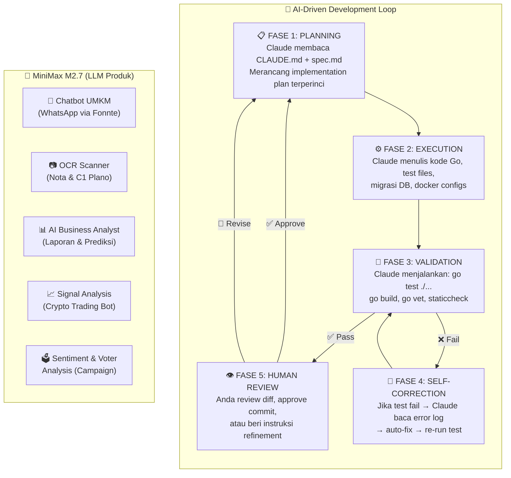

# WCH Platform — AI Agent Development Master Plan
## Claude Code + MiniMax M2.7 as the Core Intelligence Engine

Dokumen ini adalah **panduan operasional lengkap** untuk membangun seluruh ekosistem platform WCH menggunakan pendekatan **AI-Driven Development (AI-DD)** — di mana Claude Code bertindak sebagai AI Agent utama (Supervisor + Executor), dan **MiniMax M2.7** digunakan sebagai otak LLM backend untuk semua fitur produk (AI Gateway, Chatbot UMKM, OCR, dan Analitik Pemilu).

---

## 🧠 Mengapa Claude Code + MiniMax M2.7?

### Claude Code sebagai AI Development Agent
Claude Code adalah CLI-based agentic tool dari Anthropic yang mampu:
- 📁 Membaca & memahami seluruh struktur kode monorepo
- ✍️ Menulis, memodifikasi, dan me-refactor kode secara mandiri
- 🧪 Menjalankan perintah terminal (build, test, lint, migration)
- 🔁 Melakukan self-correction loop ketika test atau build gagal
- 🤝 Beroperasi dalam pola **multi-agent** (Supervisor + Executor)

### MiniMax M2.7 sebagai LLM Produk
| Spesifikasi | Detail |
| :--- | :--- |
| **Arsitektur** | Sparse MoE (Mixture-of-Experts) |
| **Total Parameter** | 230 Miliar (10B aktif per token) |
| **Context Window** | 204.800 token (ideal untuk codebase besar) |
| **Kecepatan Inferensi** | ~60-100 token/detik |
| **Harga API** | $0.30 / 1M input token · $1.20 / 1M output token |
| **Keunggulan** | Dioptimalkan untuk coding, agentic workflows, tool-calling |
| **Kompatibilitas** | OpenAI-compatible API (`https://api.minimax.io/v1`) |
| **Benchmark Coding** | SWE-Pro 56.2% · Terminal Bench 2 57.0% |

MiniMax M2.7 dipilih karena kemampuan **recursive self-optimization**, **hallucination rate rendah**, dan **biaya jauh lebih hemat** dibanding GPT-4o atau Claude 3.5 Sonnet untuk use-case chatbot volume tinggi.

---

## 1. Arsitektur AI Agent Development Workflow



---

## 2. Struktur File Konfigurasi AI Agent (Claude Code)

Untuk membuat Claude Code bekerja secara optimal di monorepo ini, kita menggunakan sistem file konfigurasi berlapis:

```
core_project/
├── CLAUDE.md                      ← Memori permanen Claude (Project Brain)
├── .claude/
│   ├── commands/                  ← Slash commands kustom Claude
│   │   ├── build-service.md       ← /build-service auth-service
│   │   ├── new-feature.md         ← /new-feature <nama> <app>
│   │   ├── run-tests.md           ← /run-tests
│   │   └── db-migrate.md         ← /db-migrate
│   ├── agents/                    ← Spesialis subagent
│   │   ├── go-backend-dev.md      ← Ahli Go, Gin, PostgreSQL
│   │   ├── ai-integration.md      ← Ahli LLM, Prompt Engineering
│   │   ├── infra-devops.md        ← Ahli Docker, CI/CD, deployment
│   │   └── security-auditor.md   ← Ahli keamanan kode & enkripsi
│   └── specs/                     ← Dokumen spesifikasi tugas per fitur
│       ├── umkm-accounting.md
│       ├── crypto-bot-engine.md
│       └── campaign-realcount.md
└── docs/
    └── master_plan_ai_dev.md      ← Dokumen ini
```

---

## 3. File Konfigurasi Inti: `CLAUDE.md`

> File ini adalah **"otak permanen"** yang dibaca Claude Code di setiap sesi. Ia mendefinisikan aturan proyek, konvensi kode, dan batasan operasional.

```markdown
# WCH Platform — Claude Project Memory

## 🎯 Identitas Proyek
Platform SaaS multi-produk berbasis Go dengan 3 produk utama:
1. ~~**Crypto Trading Bot** (apps/crypto)~~ — ~~high-frequency async worker~~ *(ARCHIVED)*
2. **UMKM AI Agent & Accounting** (apps/umkm) — chatbot + bookkeeping
3. **Campaign Management** (apps/campaign) — election winning platform

## 🏗️ Arsitektur & Struktur Kritis
- MONOREPO: satu `go.mod` di root (`module core_project`)
- Shared config: `shared/sdk/config/config.go` — SELALU gunakan ini, JANGAN hardcode nilai
- Shared services: `services/` — auth, ai-gateway, billing, notify, tenant, workflow
- Frontend: Next.js di `frontend/` (terpisah dari Go backend)

## ⚙️ Konvensi Pengembangan (WAJIB DIIKUTI)
1. **Go**: Gunakan `net/http` standar atau `github.com/gin-gonic/gin` untuk API
2. **Database**: Gunakan `pgx/v5` langsung — JANGAN gorm/ORM berat
3. **Error handling**: Selalu kembalikan error eksplisit — JANGAN panic kecuali di main()
4. **Logging**: Gunakan `log/slog` (structured logging) — BUKAN fmt.Println
5. **Tests**: Setiap handler WAJIB punya unit test di file `*_test.go`
6. **Environment**: SEMUA config dari `.env` via `config.LoadConfig()` — JANGAN os.Getenv langsung
7. **MiniMax M2.7**: Gunakan melalui `services/ai-gateway` — JANGAN panggil API LLM langsung dari app

## 🤖 MiniMax M2.7 Integration
- Base URL: `https://api.minimax.io/v1`
- Model Name: `MiniMax-M2.7`
- Go library: `github.com/sashabaranov/go-openai` (set custom BaseURL)
- Selalu tambahkan semantic caching (Redis) sebelum call LLM

## 🔒 Aturan Keamanan (KRITIS - JANGAN LANGGAR)
- API Key exchange crypto: SELALU enkripsi AES-256 sebelum simpan ke DB
- Data pemilih (campaign): WAJIB enkripsi kolom sensitif (NIK, nama, alamat)
- JWT secret: min 32 karakter, dari env — JANGAN default value di produksi
- JANGAN commit file `.env` ke git (sudah ada di .gitignore)

## 🚫 Larangan Keras
- JANGAN gunakan `database/sql` tanpa pgx
- JANGAN gunakan float64 untuk kalkulasi uang — gunakan `int64` (sen/satoshi)
- JANGAN panggil exchange API langsung dari handler — selalu lewat worker/queue
- JANGAN hapus file `shared/` tanpa konfirmasi eksplisit

## 📋 Cara Menjalankan
- Infrastruktur lokal: `docker compose -f infra/docker/docker-compose.yml up -d`
- Jalankan service: `go run ./services/auth-service/main.go`
- Test semua: `go test ./...`
- Build semua: `go build ./...`
- Tidy module: `go mod tidy`
```

---

## 4. Spesifikasi Penggunaan MiniMax M2.7 per Produk

### 📌 Integrasi di `services/ai-gateway`
Semua panggilan ke MiniMax M2.7 dipusatkan melalui AI Gateway untuk:
- ✅ Rate limiting global
- ✅ Semantic caching (Redis) — hemat biaya token 40-60%
- ✅ Fallback otomatis jika MiniMax mengalami downtime
- ✅ Logging dan monitoring biaya per tenant

```go
// Contoh konfigurasi MiniMax M2.7 di Go (via go-openai)
config := openai.DefaultConfig(cfg.AI.MiniMaxAPIKey)
config.BaseURL = "https://api.minimax.io/v1"
client := openai.NewClientWithConfig(config)

resp, err := client.CreateChatCompletion(ctx, openai.ChatCompletionRequest{
    Model: "MiniMax-M2.7",
    Messages: []openai.ChatCompletionMessage{
        {Role: openai.ChatMessageRoleSystem, Content: systemPrompt},
        {Role: openai.ChatMessageRoleUser,   Content: userMessage},
    },
})
```

### 🗺️ Peta Penggunaan LLM per Fitur

| Fitur | Model M2.7 | System Prompt Strategy | Cache? |
|:---|:---|:---|:---|
| **UMKM Chatbot (WA/TG)** | MiniMax-M2.7 | RAG + Product Catalog context | ✅ Ya (Redis 10 menit) |
| **OCR Receipt Scanner** | MiniMax-M2.7 (vision via API) | Structured JSON extraction prompt | ❌ Tidak (unique per gambar) |
| **Conversational Accounting** | MiniMax-M2.7 | Double-entry bookkeeping persona | ✅ Ya (Redis 5 menit) |
| **AI Business Analyst** | MiniMax-M2.7 | Financial analyst + Indonesian GAAP | ✅ Ya (Redis 1 jam) |
| **Crypto Signal Bot** | MiniMax-M2.7 | Technical analysis expert | ❌ Tidak (real-time data) |
| **Campaign Sentiment** | MiniMax-M2.7 | Indonesian political analyst | ✅ Ya (Redis 15 menit) |
| **AI Political Advisor** | MiniMax-M2.7 | Policy expert + election law context | ✅ Ya (Redis 30 menit) |

---

## 5. Rencana Sprint AI-Agent Development (6 Bulan)

Setiap sprint dikerjakan dengan siklus **Plan → Execute → Test → Review** menggunakan Claude Code sebagai executor utama.

### 🗓️ SPRINT 1 (Minggu 1-2): Platform Brain & Database Schema
**Instruksi Claude Code**:
```bash
claude "Buat skema PostgreSQL lengkap untuk monorepo WCH platform.
Buat file migrations di shared/migrations/ menggunakan format
[timestamp]_[nama].up.sql dan [timestamp]_[nama].down.sql.
Tabel yang dibutuhkan:
- tenants (id, name, plan, api_quota, created_at)
- users (id, tenant_id, username, email, password_hash, role, mfa_secret)
- refresh_tokens (id, user_id, token_hash, expires_at)
- ai_usage_logs (id, tenant_id, model, tokens_in, tokens_out, cost_usd, created_at)
Semua tabel wajib: id uuid PRIMARY KEY DEFAULT gen_random_uuid()
Gunakan konvensi snake_case. Sertakan indexes pada foreign keys."
```

### 🗓️ SPRINT 2 (Minggu 3-4): Auth Service (Full Go)
**Instruksi Claude Code**:
```bash
claude "Upgrade services/auth-service/main.go dari mock ke implementasi penuh.
Gunakan pgx/v5 untuk PostgreSQL, golang-jwt/jwt untuk JWT.
Implementasikan:
1. POST /register - hash password dengan bcrypt, simpan ke DB
2. POST /login - verify password, issue JWT access + refresh token (Redis)
3. POST /refresh - rotate refresh token
4. POST /logout - revoke refresh token dari Redis
5. GET /validate - middleware untuk verifikasi JWT (dipakai services lain)
Tulis unit tests untuk semua handler di auth_test.go.
Jalankan go test ./services/auth-service/... setelah selesai."
```

### 🗓️ SPRINT 3 (Minggu 5-6): AI Gateway + MiniMax M2.7 Integration
**Instruksi Claude Code**:
```bash
claude "Bangun services/ai-gateway sebagai proxy cerdas ke MiniMax M2.7.
Tambahkan dependensi: github.com/sashabaranov/go-openai
Fitur wajib:
1. POST /v1/chat - route ke MiniMax M2.7 via OpenAI-compat client
2. Semantic cache: hash prompt → check Redis → serve cache jika hit
3. Rate limiting: max 100 req/menit per tenant_id (Redis sliding window)
4. Cost tracking: hitung token usage, simpan ke ai_usage_logs table
5. Fallback: jika MiniMax error 5xx → retry 2x → return error 503
6. Streaming support: SSE (Server-Sent Events) untuk response real-time
Tulis benchmark test untuk endpoint /v1/chat."
```

### 🗓️ SPRINT 4 (Minggu 7-8): UMKM Accounting Core
**Instruksi Claude Code**:
```bash
claude "Bangun apps/umkm/accounting/ sebagai double-entry bookkeeping engine.
Schema tambahan DB:
- chart_of_accounts (id, tenant_id, code, name, type, parent_id)
- journal_entries (id, tenant_id, date, description, reference)
- journal_lines (id, entry_id, account_id, debit, credit) -- gunakan int64 (sen)
Endpoint API:
1. POST /accounts - tambah akun baru
2. POST /transactions - catat transaksi (validasi: total debit = total kredit)
3. GET /reports/income-statement?from=&to= - laporan laba rugi
4. GET /reports/balance-sheet?date= - neraca keuangan
5. GET /reports/cash-flow?from=&to= - arus kas
Semua amount dalam rupiah HARUS disimpan sebagai int64 (satuan sen/persen).
Buat seeder untuk COA standar SAK-EMKM Indonesia."
```

### 🗓️ SPRINT 5 (Minggu 9-10): UMKM WhatsApp AI Chatbot (Fonnte)
**Instruksi Claude Code**:
```bash
claude "Integrasikan Fonnte WhatsApp API ke apps/umkm/chatbot/.
Fonnte API endpoint: https://api.fonnte.com/send (POST, auth: token header)
Alur chatbot:
1. POST /webhook/whatsapp - terima pesan masuk dari Fonnte
2. Parse pesan → kirim ke AI Gateway (MiniMax M2.7) dengan system prompt UMKM
3. Kelola session percakapan di Redis (key: 'chat:session:{phone}', TTL 30 menit)
4. Format respons AI → kirim balik ke nomor pengirim via Fonnte API
5. Intent detection: jika user minta 'catat transaksi X' → trigger accounting API
System prompt: 'Kamu adalah asisten bisnis cerdas untuk UMKM Indonesia.
Kamu membantu mencatat keuangan, menjawab pertanyaan produk, dan
menganalisis kondisi bisnis. Selalu jawab dalam bahasa Indonesia yang ramah.'"
```

### 🗓️ ~~SPRINT 6 (Minggu 11-12): Crypto Trading Bot Engine)~~ *(ARCHIVED)*
1. Bot config storage di DB (encrypted api_key, api_secret dengan AES-256)
2. DCA Bot: interval cron-based buy berdasarkan nilai tetap (misal: Rp 100.000/hari)
3. Grid Bot: set lower/upper price range → auto buy saat turun, sell saat naik
4. Price monitor worker: goroutine yang stream harga via WebSocket setiap 1 detik
5. Order executor: queue-based (Redis channel) untuk eksekusi buy/sell
6. PnL calculator: kalkulasi profit/loss real-time per bot
Schema DB: bots, bot_orders, bot_pnl_snapshots
PENTING: Semua API Key di-encrypt menggunakan AES-256-GCM sebelum simpan ke DB."
```

### 🗓️ SPRINT 7 (Minggu 13-14): Campaign Management & Voter Mapping
**Instruksi Claude Code**:
```bash
claude "Bangun apps/campaign/ untuk manajemen kampanye pemilu.
Komponen:
1. apps/campaign/volunteer/ - API registrasi relawan:
   - POST /volunteers - daftar relawan (nama, NIK terenkripsi, dapil, koordinat GPS)
   - POST /checkins - relawan check-in saat bertugas (GPS + timestamp)
   - GET /volunteers/leaderboard - papan peringkat keaktifan relawan
2. apps/campaign/analytics/ - pemetaan suara:
   - POST /voters - input data calon pemilih (enkripsi data PII)
   - GET /voters/map - data agregat pendukung per kelurahan (GeoJSON format)
   - POST /realcount/tps - input perolehan suara TPS oleh saksi
   - GET /realcount/summary - rekap perolehan suara real-time
3. Enkripsi wajib: NIK, nama lengkap, alamat pemilih harus terenkripsi AES-256
4. Integrasi MiniMax M2.7 via AI Gateway untuk:
   - Analisis sentimen media sosial (POST /sentiment/analyze)
   - Rekomendasi strategi kampanye (POST /ai/strategy-advisor)"
```

### 🗓️ SPRINT 8 (Minggu 15-16): Billing Service & SaaS Monetization
**Instruksi Claude Code**:
```bash
claude "Bangun services/billing-service/ untuk monetisasi platform.
Integrasi payment gateway: Xendit API (https://api.xendit.co)
Fitur:
1. POST /subscriptions - buat langganan baru (pilih plan: lite/pro/ultimate)
2. POST /invoices/create - generate invoice bulanan otomatis
3. POST /webhook/xendit - terima notifikasi pembayaran dari Xendit
4. PATCH /subscriptions/{id}/upgrade - upgrade plan
5. GET /usage/{tenant_id} - laporan penggunaan AI token & bot activity
6. Cron job harian: cek expired subscription → kirim notifikasi WA via Fonnte
Schema: subscription_plans, tenant_subscriptions, invoices, payments
Terapkan feature flags: limit bot count dan AI quota berdasarkan active plan."
```

### 🗓️ SPRINT 9 (Minggu 17-18): Frontend Next.js (3 Web App)
**Instruksi Claude Code**:
```bash
claude "Buat boilerplate frontend Next.js 14 (App Router) untuk 3 produk.
Gunakan: TypeScript, Tailwind CSS, shadcn/ui, react-query, zustand.
Buat 3 app terpisah di frontend/:
1. frontend/crypto-web - Dashboard trading bot (dark theme, TradingView charts)
2. frontend/umkm-web - Dashboard UMKM (clean, friendly, mobile-first)
3. frontend/campaign-web - Dashboard kampanye (profesional, map integration)
Setiap app harus punya:
- Halaman Login/Register yang terhubung ke auth-service
- Layout dengan sidebar navigasi
- Komponen shared di frontend/shared/components/
- API client yang terhubung ke backend Go services
Buat README.md di setiap app dengan instruksi run development."
```

### 🗓️ SPRINT 10 (Minggu 19-20): N8N Workflow & Notification Integration
**Instruksi Claude Code**:
```bash
claude "Buat workflow n8n dan integrasikan notification service.
1. Bangun services/notification-service/main.go:
   - POST /notify/whatsapp - kirim WA via Fonnte
   - POST /notify/email - kirim email via SMTP
   - Template engine: baca template dari DB, render dengan data
2. Tambahkan variabel FONNTE_TOKEN ke .env dan config.go
3. Dokumentasikan endpoint webhook n8n di docs/n8n-workflows.md:
   - Workflow: 'UMKM Monthly Report' - kirim laporan keuangan bulanan via WA
   - Workflow: 'Crypto Bot Alert' - kirim notifikasi order success/fail ke Telegram
   - Workflow: 'Campaign Daily Briefing' - rekap perolehan suara harian ke tim
4. Buat contoh n8n workflow JSON di infra/n8n/workflows/"
```

### 🗓️ SPRINT 11 (Minggu 21-22): Security Hardening & Audit
**Instruksi Claude Code**:
```bash
claude "Lakukan security audit menyeluruh pada seluruh codebase.
Tasks:
1. Jalankan: go vet ./... dan staticcheck ./... — perbaiki semua warning
2. Cek SQL injection: pastikan semua query pakai parameterized statements (pgx)
3. Review enkripsi: verifikasi AES-256-GCM digunakan konsisten untuk data sensitif
4. Rate limiting: verifikasi Redis-based rate limiting aktif di semua public endpoints
5. Header security: tambahkan middleware security headers (CORS, CSP, HSTS)
6. Dependency audit: jalankan go mod verify dan periksa known CVEs
7. Buat laporan audit di docs/security-audit.md dengan findings dan remediasi
8. Tambahkan integration tests end-to-end di tests/ folder"
```

### 🗓️ SPRINT 12 (Minggu 23-24): Production Deploy & CI/CD
**Instruksi Claude Code**:
```bash
claude "Siapkan pipeline CI/CD dan konfigurasi deployment produksi.
1. Buat .github/workflows/ci.yml:
   - Trigger: push ke main dan pull request
   - Jobs: lint (golangci-lint), test (go test -race ./...), build (go build ./...)
2. Buat .github/workflows/cd.yml:
   - Trigger: push tag v*.*.* (semantic versioning)
   - Jobs: build Docker images, push ke GHCR, SSH deploy ke VPS
3. Buat Dockerfile multi-stage untuk setiap service di services/ dan apps/
4. Update infra/docker/docker-compose.prod.yml dengan semua services
5. Buat infra/nginx/nginx.conf dengan rate limiting dan SSL termination
6. Tambahkan health check endpoint /health di semua services
7. Buat runbook deployment di docs/deployment-runbook.md"
```

---

## 6. Estimasi Biaya MiniMax M2.7 per Produk

Perhitungan berdasarkan tarif **$0.30/1M input token** dan **$1.20/1M output token**:

### 💼 UMKM Chatbot (Fonnte + MiniMax M2.7)
| Skenario | Input Token/bulan | Output Token/bulan | Biaya/bulan |
|:---|:---|:---|:---|
| Starter (50 chat/hari) | ~500K token | ~250K token | **~$0.45/bulan** |
| Grow (500 chat/hari) | ~5M token | ~2.5M token | **~$4.50/bulan** |
| Scale (5.000 chat/hari) | ~50M token | ~25M token | **~$45/bulan** |

*Dengan semantic caching Redis (estimasi 50% cache hit rate) → biaya berkurang ~50%*

### 🚀 Crypto Signal Analysis
| Skenario | Penggunaan | Biaya/bulan |
|:---|:---|:---|
| 10 bot aktif, analisis setiap jam | ~10M token | **~$15/bulan** |

### 🗳️ Campaign Sentiment Analysis
| Skenario | Penggunaan | Biaya/bulan |
|:---|:---|:---|
| 1 kampanye aktif, scan 1.000 tweet/hari | ~30M token | **~$45/bulan** |

**Total Estimasi Biaya AI per Bulan (full operation):** ~$100-150/bulan ← jauh lebih hemat dari OpenAI GPT-4o (~$600-900/bulan untuk volume sama).

---

## 7. Panduan Menjalankan Claude Code di Proyek Ini

### Instalasi Claude Code
```bash
# Install Claude Code CLI
npm install -g @anthropic-ai/claude-code

# Masuk ke direktori proyek
cd /home/syahril/Desktop/dev/core_project

# Mulai sesi Claude Code
claude
```

### Contoh Perintah Efektif untuk Proyek Ini
```bash
# Minta Claude membuat fitur baru
claude "Tambahkan endpoint GET /bots/{id}/performance di crypto app
yang mengembalikan statistik bot: total trades, win rate, PnL 7/30 hari"

# Minta Claude debug error
claude "Jalankan go test ./services/auth-service/... dan perbaiki semua test yang gagal"

# Minta Claude review keamanan
claude "Review apps/umkm/accounting/ untuk potensi SQL injection dan data validation issues"

# Minta Claude generate dokumentasi
claude "Buat dokumentasi API OpenAPI 3.0 (swagger) untuk semua endpoint di services/auth-service"
```

### Tips Optimal Menggunakan Claude Code
1. **Mulai Setiap Sesi dengan**: `claude "Baca CLAUDE.md dan berikan ringkasan state proyek saat ini"`
2. **Untuk Task Besar**: Minta Claude buat `spec.md` terlebih dahulu sebelum coding
3. **Gunakan `/compact`**: Setelah context panjang, minta Claude kompres memori untuk efisiensi
4. **Checkpoint sebelum refactor besar**: `git stash` dulu agar mudah rollback jika perlu
5. **Iterative Development**: Berikan instruksi spesifik per endpoint/fitur, bukan sekaligus semua

---

## 8. Environment Variable Tambahan untuk MiniMax M2.7

Tambahkan ke berkas [`.env`](file:///home/syahril/Desktop/dev/core_project/.env):

```ini
# ==========================================
# AI: MiniMax M2.7 Configuration
# ==========================================
MINIMAX_API_KEY=your_minimax_api_key_from_platform_minimax_io
MINIMAX_BASE_URL=https://api.minimax.io/v1
MINIMAX_MODEL=MiniMax-M2.7

# AI Cache Settings (Redis-based Semantic Cache)
AI_CACHE_ENABLED=true
AI_CACHE_TTL_SECONDS=600     # Default: 10 menit
AI_COST_ALERT_USD=10.00      # Alert jika biaya harian melebihi $10

# Claude Code Agent Settings (untuk development workflow)
CLAUDE_MODEL=claude-sonnet-4-5
ANTHROPIC_API_KEY=your_anthropic_api_key_here
```

---

## 9. File `CLAUDE.md` — Siap Deploy ke Root Proyek

File ini adalah dokumen hidup yang harus diperbarui setiap kali ada perubahan arsitektur besar. Ia adalah sumber kebenaran tunggal bagi Claude Code Agent ketika beroperasi di repositori ini.

> 📌 **Aksi Pertama**: Buat file `CLAUDE.md` di root proyek dan isi dengan konten dari Bagian 3 di atas. Claude Code akan otomatis membacanya di setiap sesi baru.

---

*Dokumen ini adalah panduan operasional AI-Driven Development untuk WCH Multi-Product Platform.*
*Dibuat oleh Antigravity (Advanced Agentic Coding — Google DeepMind) · Versi 1.0 · Mei 2026*
